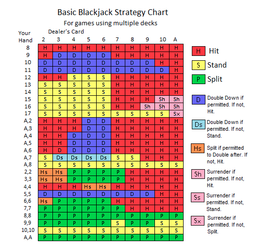

# Blackjack Basic Strategy and Card Counting

## Intro

Want to practice memorizing blackjack basic strategy? Want to even out the casino edge by counting cards? You've come to the right place! This python program will show you actual examples of blackjack hands with correct basic strategy used. 

## Setup

Fork and clone this repo.

Inside the project folder, run `python3 blackjack.py`

## Basic Strategy Table

## Rules

When running this simulation, certain blackjack rules can be changed with the `rules.py` file. However, the present code makes the following assumptions: 

- Shoe has six decks

- Player blackjack pays out 3 to 2

- Counting cards uses the True Count method. +1 is given to cards numbered 2-6, and -1 is given to cards 10-A. Once the count divided by the number of decks is greater or equal to 1, the player's bet doubles.

- Late surrender is allowed

- Dealer must hit on soft 17

- Player can double down after a split

- Player has a starting bankroll of $50,000

# Instructions

Run each hand and compare to basic strategy table to see why each decision is made. Keep note of the displayed running count, and notice at what point bets are increased.

In order to simulate a large number of hands instead of individual hands, comment in `for i in range(100000):` and change the number to the desired amount of simulations. Then comment out the wording needed to play each individual hand, which includes at the beginning `# while True:   # play = str(input("Would you like to play the blackjack hand? y/n "))   # if play == 'y' or play == 'Y':` and at the end `# elif play == "N" or play =="n":   #     break   # else:   #     print("Please enter y/n")`

